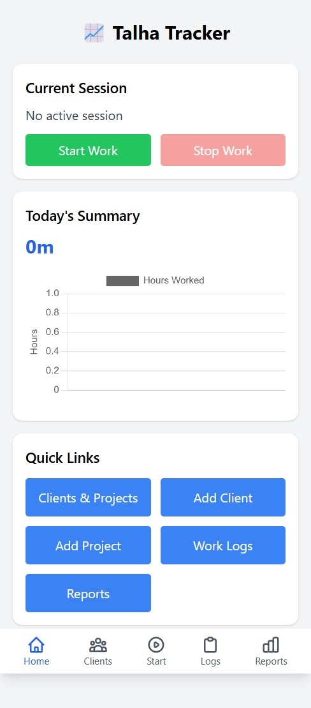
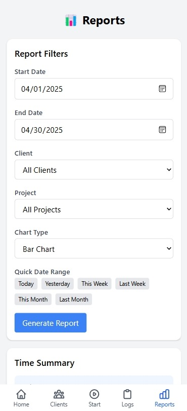

### Talha Tracker

A lightweight, mobile-friendly time tracking application for freelancers and developers to monitor project progress and client work.


## 📸 Screenshot





## My Story

I created Talha Tracker out of necessity. As a programmer managing multiple projects on my own server, I was frustrated with existing time tracking solutions that were either too complex, not mobile-friendly, or didn't match my workflow.

I needed a simple yet effective way to track how much time I spent on each project for different clients. This would help me improve my productivity, provide accurate billing, and maintain a clear record of my work. Most importantly, I wanted something I could easily access from my mobile device without depending on third-party tools that didn't align with my preferences.

Talha Tracker is the result - a straightforward, self-hosted time tracking solution that focuses on what matters most: recording time spent, organizing by client and project, and generating insightful reports.

## Features

- **Simple Time Tracking**: Start and stop work sessions with a single click
- **Client & Project Management**: Organize your work by client and project
- **Mobile-Friendly Interface**: Access from any device with a responsive design
- **Detailed Reports**: Filter and visualize your time data with multiple chart types
- **Work Logs**: View and manage your complete work history
- **Dashboard Overview**: See your daily, weekly, and monthly progress at a glance
- **No Internet Dependency**: Works on your local server or intranet


## Installation

### Requirements

- PHP 7.4 or higher
- SQLite 3
- Web server (Apache, Nginx, etc.)


### Quick Install

1. Clone the repository:

```shellscript
git clone https://github.com/yourusername/talha-tracker.git
```


2. Move the files to your web server directory:

```shellscript
mv talha-tracker /var/www/html/
```


3. Set proper permissions:

```shellscript
chmod 755 -R /var/www/html/talha-tracker
chmod 777 -R /var/www/html/talha-tracker/db
```


4. Create the database:

```shellscript
cd /var/www/html/talha-tracker
php db/init.php
```


5. Access the application in your browser:

```plaintext
http://localhost/talha-tracker
```


Then access at `http://localhost:8080`

## Configuration

The application uses SQLite by default. You can modify the database configuration in `config/database.php`:

```php
<?php
// Database configuration
define('DB_PATH', __DIR__ . '/../db/talha_tracker.db');
```

## Usage Guide

### Adding Clients

1. Navigate to "Clients & Projects"
2. Click "Add Client"
3. Enter client details and save


### Adding Projects

1. Navigate to "Clients & Projects"
2. Click "Add Project"
3. Select a client, enter project details and save


### Tracking Time

1. From the dashboard, click "Start Work"
2. Select the project you're working on
3. Add optional notes
4. When finished, click "Stop Work"


### Viewing Reports

1. Navigate to "Reports"
2. Use filters to select date range, client, or project
3. Choose your preferred chart type
4. View time distribution and detailed work sessions


## Screenshots


## Technologies Used

- PHP
- SQLite
- HTML/CSS/JavaScript
- Tailwind CSS
- Chart.js


## Directory Structure

```plaintext
talha-tracker/
├── config/
│   └── database.php
├── db/
│   └── init.php
├── includes/
│   ├── footer.php
│   ├── functions.php
│   └── header.php
├── add_client.php
├── add_project.php
├── clients.php
├── delete_client.php
├── delete_project.php
├── delete_work_session.php
├── edit_client.php
├── edit_project.php
├── index.php
├── reports.php
├── start_work.php
├── stop_work.php
├── work_logs.php
└── README.md
```

## Contributing

Contributions are welcome! Please feel free to submit a Pull Request.

1. Fork the repository
2. Create your feature branch (`git checkout -b feature/amazing-feature`)
3. Commit your changes (`git commit -m 'Add some amazing feature'`)
4. Push to the branch (`git push origin feature/amazing-feature`)
5. Open a Pull Request


## License

This project is licensed under the MIT License - see the [LICENSE](LICENSE) file for details.

## Acknowledgements

- [Tailwind CSS](https://tailwindcss.com/)
- [Chart.js](https://www.chartjs.org/)
- All the freelancers and developers who inspired this project


---

## Support

If you find this project helpful, please consider giving it a star on GitHub!

For issues, feature requests, or questions, please open an issue on the GitHub repository.

Created with ❤️ by Talha